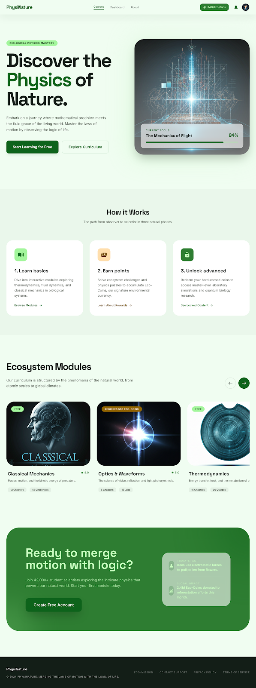
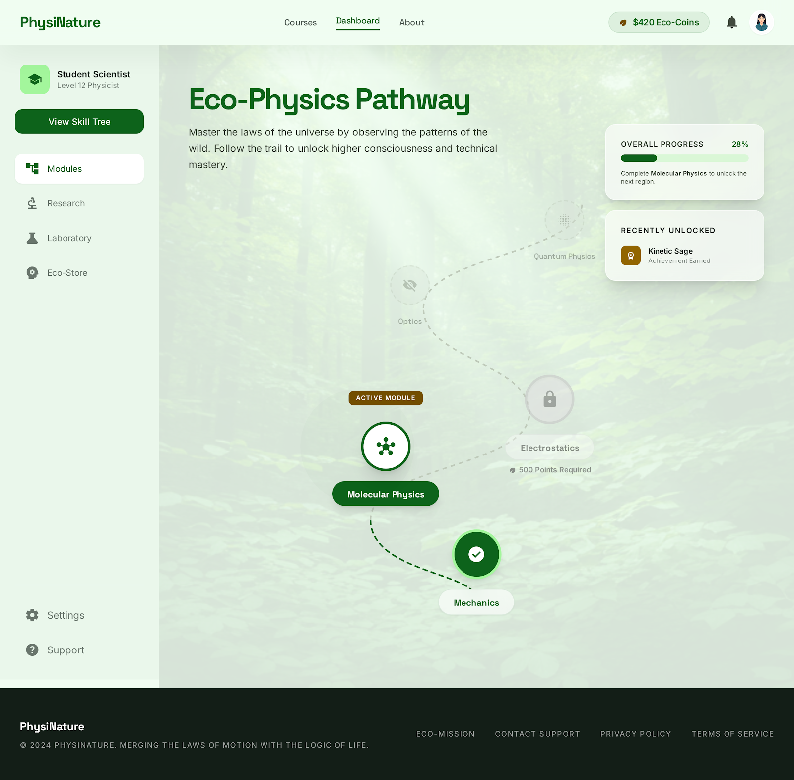

# 🌿 Eco Physics Learning Platform

> Табиғат арқылы физиканы үйрен | Learn Physics Through Nature

Бұл платформа жоғары сынып оқушылары мен студенттерге физика пәнін интерактивті, экологиялық мысалдар арқылы үйретуге арналған веб-қосымша.

## 🚀 Live Demo

🔗 [Сайтты ашу / Open Platform](https://abibullaev-ers.github.io/eco1)

## 📸 Screenshots




## ✨ Features

- 🏠 **Home Dashboard** — Табиғаттың физикасын ашу
- 🗺️ **Learning Map** — Дағды ағашы (Skill Tree)
- ⚙️ **Section 1: Mechanics** — Механика негіздері
- 🔬 **Section 2: Molecular Physics** — Молекулалық физика
- ⚡ **Section 3: Electrostatics** — Электростатика
- 🔮 **Section 4: Quantum Physics** — Кванттық физика
- 🧪 **Zertkhana Lab** — Зертханалық тәжірибелер
- 🔭 **Zertteu Research** — Зерттеу бөлімі
- 📜 **Certificate** — Жетістік сертификаты
- 🌿 **Eco Dukan Shop** — Эко дүкен

## 🛠️ Tech Stack

| Technology | Usage |
|------------|-------|
| HTML5 | Structure |
| CSS3 | Styling & Animations |
| JavaScript | Interactivity |
| Vercel | Deployment |

## 📁 Project Structure

```
eco1/
├── index.html                        # Main entry point
├── home_discover_nature_s_physics/   # Home page
├── learning_map_the_skill_tree/      # Skill tree map
├── lesson_kinematics_in_nature/      # Kinematics lesson
├── section1_mechanics/               # Mechanics section
├── section2_molecular/               # Molecular physics
├── section3_electrostatics/          # Electrostatics
├── section4_quantum/                 # Quantum physics
├── chlorophyll_physics/              # Chlorophyll & physics
├── zertkhana_lab/                    # Laboratory
├── zertteu_research/                 # Research section
├── eco_dukan_shop/                   # Eco shop
├── login_register/                   # Authentication
├── main_dashboard/                   # Dashboard
└── your_achievement_certificate/     # Certificates
```

## 👨‍💻 Developer

**Ерсұлтан Абибуллаев** — [@abibullaev-ers](https://github.com/abibullaev-ers)

---
⭐ Ұнаса жұлдыз қойыңыз! | If you like it, give a star!
